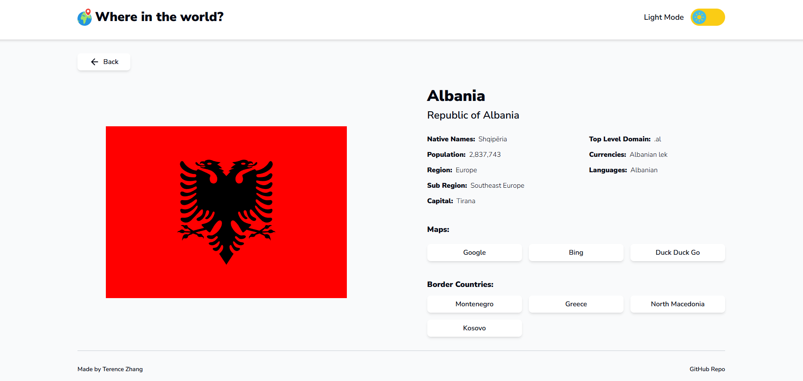

# Where in the World? - A React Web App

A Frontend React web application which shows detailed information about countries around the world. Users can browse, search, and filter countries by region, view country details including population, capital, languages, currencies, and neighbouring countries. You can view the [live website here](https://terenceclzhang-rest-countries.netlify.app).

This project was insipired by the [Frontend Mentor REST Countries API with color theme switcher challenge](https://www.frontendmentor.io/challenges/rest-countries-api-with-color-theme-switcher-5cacc469fec04111f7b848ca).

## Features

- **Search countries** by name with real-time filtering.
- **Filter countries** by region (Africa, Americas, Asia, Europe, Oceania).
- **Sort countries** by name (A-Z, Z-A) and population (ascending, descending).
- **Responsive design** for desktop and mobile devices.
- **Detailed country pages** showing flags, official name, native names, population, region, subregion, capital, top-level domain, currencies, languages, and border countries.
- **Visit country locations** via direct links to Google, Bing, and DuckDuckGo Maps from the details page.
- **Dark mode toggle** for better user experience.

## Technologies Used

- React
- TypeScript
- React Router
- Axios
- Tailwind CSS
- Framer Motion
- Lucide React
- React Hot Toasts
- [REST Countries API](https://restcountries.com/)

## Contributions

This is a personal project created to showcase my skills. I am not accepting contributions at this time.

## License

This project is released under the [MIT License](LICENSE). You are free to use, modify, and distribute this project in accordance with the terms of the license.
